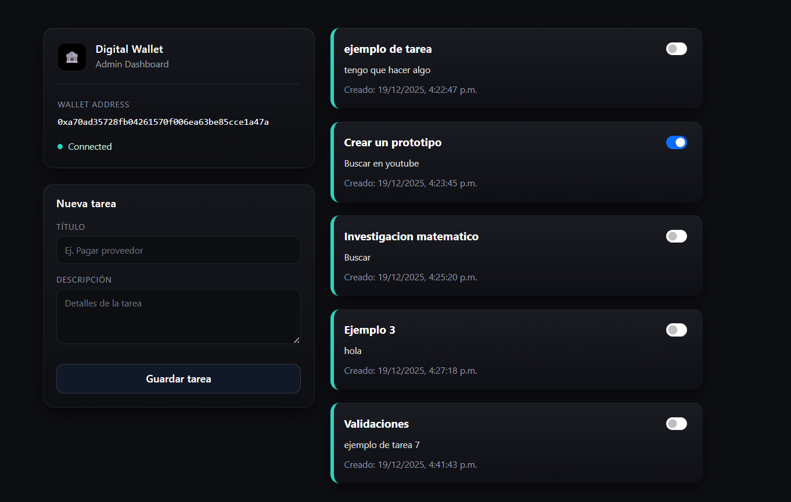

<!-- Analisis de dashboard -->
Esta es una Aplicación Descentralizada (DApp) diseñada para gestionar tareas de forma transparente y segura.
A diferencia de una aplicación tradicional, estos registros están almacenados directamente en la Blockchain de Ethereum.
y nescesitan el codigo de acceso para realizar cualquier accion

<!-----vISTA DEL TRABAJO-->
<h2>Trabajos :octocat:</h2>

<p align="center">
<table align="left">
<tr border="none">

<td width="40%" align="center">
  
</td>

<td width="60%" align="center">
  
</td>

</tr>
</table>
</p>


<p align="center"> Tecnologías usadas </p>
<p align="center">  </p>

<hr>

```
Explicacion: 
-------------------------
🌐 Solidity
    - Es el lenguaje que usamos para escribir los Smart Contracts
    - Definimos las reglas de cómo se crean y completan las tareas

🏗️ Truffle Suite
    - Nos ayuda a compilar el código en la red
    
⛓️ Ganache
    - Es nuestra propia Blockchain personal (simulador)

🦊 MetaMask
    -  Es tu identidad y tu billetera en el mundo Web3
    - Actúa como el puente que conecta este sitio web con
      la red Ethereum para que puedas firmar tus transacciones

⚡ JavaScript
    -  Se encarga de "hablar" con el contrato inteligente
    - actualizar la pantalla sin que tengas que recargar la página

📦 Truffle Contract:
    -  Es el traductor oficia
    - Permite que nuestro código JavaScript entienda fácilmente
      cómo leer y escribir datos dentro del Smart Contract.

```
<hr>
